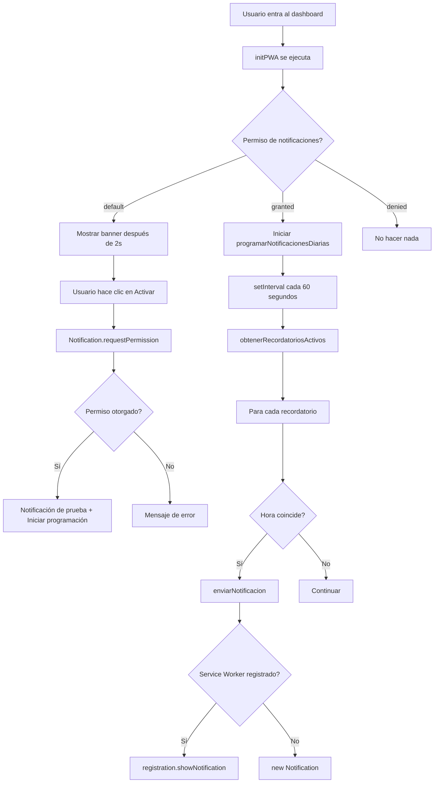

# Guía de notificaciones - HabitTrack

## Tipos de notificaciones

### 1. Notificaciones dentro de la aplicación (funcionan actualmente)
- Requiere: página abierta en el navegador
- Funciona en: localhost y producción
- API: Notification API del navegador
- Configuración: banner automático que solicita permisos

### 2. Notificaciones fuera de la aplicación (requiere configuración adicional)
- Requiere: HTTPS + Push API + suscripción del usuario
- No funciona en localhost
- Funciona en: Vercel (`https://habittrack.vercel.app`)
- Configuración: Supabase Edge Functions + Web Push

---

## Debug y pruebas

### Panel de debug (solo localhost)
Aparece en la esquina inferior derecha con dos botones:

1. **Probar notificación**
   - Envía notificación inmediata de prueba
   - Usa dos métodos: API directa + Service Worker
   - Muestra errores si algo falla

2. **Ver estado**
   - Muestra permiso actual (`granted`, `denied`, `default`)
   - Verifica si Service Worker está activo
   - Confirma soporte de Notification API

### Consola del navegador
Buscar logs con prefijos:
- `[BANNER]` - Estado del banner de permisos
- `[NOTIF]` - Inicio de programación de notificaciones
- `[NOTIF]` - Verificación periódica
- `[NOTIF]` - Recordatorios encontrados
- `[NOTIF]` - Evaluación de cada recordatorio
- `[NOTIF]` - Notificación enviada
- `[NOTIF]` - Error en notificación

---

## Solución de problemas

### El banner no aparece
Posibles causas:
1. Permiso ya otorgado/denegado → Ir a `chrome://settings/content/notifications` y resetear
2. Banner ya cerrado esta sesión → Recargar página (F5)
3. sessionStorage bloqueando → Abrir consola: `sessionStorage.clear()`

Verificar:
```javascript
// En consola del navegador
console.log("Permiso:", Notification.permission);
console.log("Banner cerrado:", sessionStorage.getItem('notificacion-banner-cerrado'));
```

### No recibo notificaciones (página abierta)
Checklist:
1. ¿Permiso otorgado?
   ```javascript
   Notification.permission === 'granted'
   ```
2. ¿Service Worker activo?
   ```javascript
   navigator.serviceWorker.controller // No debe ser null
   ```
3. ¿Recordatorio configurado?
   - Ir a "Gestionar Recordatorios" en dashboard
   - Verificar hora y que esté activo
4. ¿Hora correcta?
   - Hora se guarda en UTC
   - Se convierte a hora local al verificar

Forzar notificación de prueba:
```javascript
// En consola del navegador
new Notification("Prueba", {
  body: "Si ves esto, las notificaciones funcionan",
  icon: "https://cdn-icons-png.flaticon.com/192/2234/2234767.png"
});
```

### No recibo notificaciones (página cerrada)
Esto es el comportamiento esperado en localhost. Requiere:

1. **HTTPS**: Localhost usa HTTP, Web Push requiere HTTPS
2. **Push Subscription**: Usuario debe suscribirse a notificaciones push
3. **Backend Push Service**: Supabase Edge Function que envíe push

Para habilitar:
1. Desplegar en Vercel (ya configurado)
2. Crear Edge Function en Supabase:
   ```typescript
   // supabase/functions/send-push-notification/index.ts
   import { serve } from 'https://deno.land/std@0.168.0/http/server.ts'
   import webpush from 'npm:web-push@3.6.0'
   ```
3. Configurar VAPID keys
4. Guardar suscripciones en base de datos
5. Modificar recordatorios para usar Edge Function

---

## Archivos importantes

### Frontend (React)
- `src/components/PermisosNotificacion.tsx` - Banner de permisos
- `src/components/DebugNotificaciones.tsx` - Panel de debug
- `src/services/recordatorio/notificacionService.ts` - Lógica de notificaciones
- `src/utils/initPWA.ts` - Inicialización del Service Worker

### Service Worker
- `public/sw.js` - Service Worker custom
- `vite.config.ts` - Configuración de Vite PWA plugin

### Backend (Supabase)
- `database/migrations/notificaciones_email.sql` - Tabla de recordatorios
- `supabase/functions/send-daily-reminders/` - Edge Function para emails

---

## Flujo de notificaciones actuales



---

## Configurar recordatorios

1. En el dashboard, clic en "Gestionar Recordatorios"
2. Seleccionar hábito
3. Elegir hora (se guarda en UTC automáticamente)
4. Escribir mensaje personalizado
5. Activar recordatorio
6. **Importante:** La verificación ocurre cada 60 segundos

Ejemplo:
- Hora actual: 21:30
- Recordatorio configurado: 21:31
- Resultado: Notificación entre 21:31:00 y 21:31:59

---

## Notificaciones en producción (Vercel)

### Actualmente funcionan
- Notificaciones mientras la página está abierta
- PWA instalable en Brave/Chrome
- Iconos desde CDN (flaticon)
- Service Worker activo

### Pendiente (notificaciones push avanzadas)
- Notificaciones cuando la aplicación está cerrada
- Suscripción Web Push API
- Servicio backend de notificaciones push

### Para habilitar notificaciones push

1. **Generar VAPID Keys:**
   ```bash
   npx web-push generate-vapid-keys
   ```

2. **Guardar en Supabase Secrets:**
   ```bash
   supabase secrets set VAPID_PUBLIC_KEY=<public_key>
   supabase secrets set VAPID_PRIVATE_KEY=<private_key>
   ```

3. **Crear tabla de suscripciones:**
   ```sql
   CREATE TABLE push_subscriptions (
     id uuid PRIMARY KEY DEFAULT uuid_generate_v4(),
     id_perfil uuid REFERENCES perfil(id_perfil),
     endpoint TEXT NOT NULL,
     keys JSONB NOT NULL,
     created_at TIMESTAMPTZ DEFAULT NOW()
   );
   ```

4. **Frontend: Suscribir usuario:**
   ```typescript
   const subscription = await registration.pushManager.subscribe({
     userVisibleOnly: true,
     applicationServerKey: urlBase64ToUint8Array(VAPID_PUBLIC_KEY)
   });
   
   await supabase.from('push_subscriptions').insert({
     id_perfil: userId,
     endpoint: subscription.endpoint,
     keys: subscription.toJSON().keys
   });
   ```

5. **Edge Function: Enviar push:**
   ```typescript
   import webpush from 'web-push';
   
   webpush.setVapidDetails(
     'mailto:tu@email.com',
     VAPID_PUBLIC_KEY,
     VAPID_PRIVATE_KEY
   );
   
   await webpush.sendNotification(subscription, JSON.stringify({
     title: "Recordatorio",
     body: "Es hora de tu hábito",
     icon: "/icon-192.png"
   }));
   ```

6. **Cron Job en Supabase:**
   ```sql
   SELECT cron.schedule(
     'send-push-reminders',
     '* * * * *', -- Cada minuto
     $$ SELECT send_push_notifications(); $$
   );
   ```

---

## Referencias

- [Notification API - MDN](https://developer.mozilla.org/en-US/docs/Web/API/Notifications_API)
- [Service Worker API - MDN](https://developer.mozilla.org/en-US/docs/Web/API/Service_Worker_API)
- [Web Push Protocol](https://web.dev/push-notifications-overview/)
- [Supabase Edge Functions](https://supabase.com/docs/guides/functions)
- [Vite PWA Plugin](https://vite-pwa-org.netlify.app/)

---

## Checklist de implementación

### Completado
- [x] Banner de permisos con diseño atractivo
- [x] Panel de debug para desarrollo
- [x] Logs detallados en consola
- [x] Notificaciones en página abierta
- [x] Conversión UTC → Hora local
- [x] Prevención de duplicados
- [x] Service Worker con notificaciones
- [x] Iconos desde CDN
- [x] PWA instalable

### En progreso
- [ ] Documentar proceso completo
- [ ] Mejorar UX de recordatorios
- [ ] Agregar sonidos a notificaciones

### Pendiente
- [ ] Web Push API (notificaciones fuera de app)
- [ ] VAPID keys y suscripciones
- [ ] Edge Function para push
- [ ] Tabla de suscripciones en DB
- [ ] UI para gestionar suscripciones
- [ ] Estadísticas de notificaciones enviadas

---

**Última actualización:** consultar el historial de commits del repositorio para la fecha más reciente.
